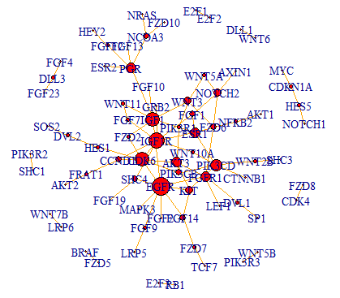
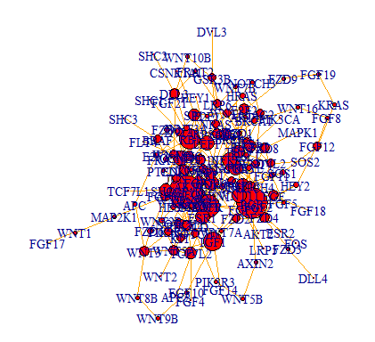
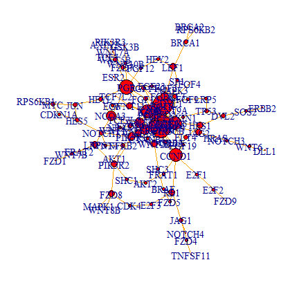

# DiffGraph R Package for Gene Network Rewiring Identification

## Overview
DiffGraph is an R package that uses state-of-the-art differential graphical models to facilitate the analysis of gene expression data and the detection of gene network rewiring. DiffGraph enables researchers to evaluate predictions from different models, explore condition-specific gene networks, and interactively assess inferred networks. The program offers several display options for network design assessment, integrated methods for constructing sample covariance matrices, and standardized input and output formats.

DiffGraph allows researchers to explore changes in gene regulation networks in a variety of experimental conditions, providing fresh insights into how various stimuli might remodel gene connections. Combining four differential graphical models, DiffGraph offers a comprehensive framework for assessing gene expression data and identifying condition-specific regulatory alterations.

This README contains links to other resources, installation instructions, use examples, and a description of DiffGraph's capabilities to assist you in efficiently analyzing gene expression data and investigating insights into gene regulatory network dynamics.

## Methodology
DiffGraph employs a robust methodology based on differential graphical models to identify gene network rewiring from gene expression data. The workflow consists of several steps:

1. **Input Data**: Gene expression data from two different experimental conditions are input to DiffGraph. For the analysis, organizing the input data into a specific format is necessary.
2. **Sample Covariance Matrices**: The first step involves computing condition-specific sample covariance matrices from the input data matrices. Three methods can be used to estimate these covariance matrices:
   - Pearson Correlation: Used for normal data.
   - Spearman's Rank Correlation: Used for non-normal data.
   - Kendall's Tau Correlation: Another option for non-normal data.
3. **Differential Graphical Models**: DiffGraph implements four main differential graphical models to identify gene network rewiring:
   - Fused Graphical Lasso (FGL)
   - Lasso Penalized D-Trace Loss (Dtrace)
   - Perturbed-Node Joint Graphical Lasso (PNJGL)
   - Prior Information-Induced Differential Network Analysis (pDNA)
4. **Precision Matrix Estimation**: To estimate the difference between two precision matrices, each model uses optimization approaches specific to that model.
5. **Visualization**: The differential networks can be visualized using both non-interactive and interactive methods, providing users with insights into the rewiring of gene regulatory networks across different conditions.

By following these steps, users can leverage DiffGraph to gain a deeper understanding of gene network dynamics and uncover condition-specific regulatory changes from their gene expression data.

## Differential Graphical Models
DiffGraph includes four differential graphical models, each developed to detect gene network rewiring by calculating the difference between two precision matrices. The models are:

1. **Fused Graphical Lasso (FGL)**
   - Uses a penalized log-likelihood technique to promote sparsity in both condition-specific and differential networks.
   - Promotes edge values that are comparable across situations.

2. **Lasso Penalized D-Trace Loss (Dtrace)**
   - Employs a direct estimation of the precision matrix difference, assuming sparsity solely on the differential network, allowing for competitive performance with smaller sample sizes.

3. **Perturbed-Node Joint Graphical Lasso (PNJGL)**
   - Uses a row-column overlap norm penalty and the presumption that disturbed nodes, not individual edges, are the source of network alterations to identify critical nodes triggering network rewiring.

4. **Prior Information-Induced Differential Network Analysis (pDNA)**
   - Extends Dtrace to handle scenarios where gene expression measurements are collected using various data types.
   - Integrates information from different data types and captures important genes driving changes in the network.

Each model offers unique advantages and may be selected based on the characteristics of the input data and specific research objectives. By leveraging these differential graphical models, DiffGraph enables users to uncover condition-specific regulatory changes and gain insights into the rewiring of gene regulatory networks.

## Dtrace Function
The Dtrace function is implemented to identify gene network rewiring using the FGL model. The function is as follows:

```R
Dtrace(X, lambda, covType, tol, maxiter)
```

### Parameters
1. **X**: A set of input matrices (length = 2). These might be covariance matrices or data matrices. The matrices are taken to be covariance matrices among genes if each matrix in X is symmetric. If the input consists of data matrices, the genes are represented by the columns and the observations by the rows.
2. **lambda**: A positive integer. The estimated differential network's level of sparsity is set by this tuning parameter.
3. **covType**: A factor that determines which method is used to calculate the sample variance matrices.
   - The implementation of Dtrace is based on Gaussian graphical models, and sample covariance matrices are calculated using Pearson correlation if covType is set to "pearson". The recommendation is "pearson" if the data is normal.
   - Sample covariance matrices are calculated using Kendall's tau correlation or Spearman's rho correlation if covType is "kendall" or "spearman," and Dtrace is implemented using nonparanormal graphical models. It is recommended to use "kendall" or "spearman" if the data is not usual.
4. **tol**: The tolerance parameter for convergence criteria.
5. **maxiter**: The maximum number of iterations.

## Features
DiffGraph offers a range of features designed to streamline gene network rewiring analysis and facilitate comprehensive exploration of gene expression data. Key features include:

1. **Unified Input and Output Format**:
   - Consistent format for input data and output results across all models, enabling easy comparison and follow-up analysis.

2. **Integrated Methods for Sample Covariance Matrix**:
   - Three integrated techniques that support a variety of data types and distributional assumptions are available for calculating sample covariance matrices from input data matrices.

3. **Four Built-in Differential Graphical Models**:
   - Combining four important differential graphical models: Lasso Penalized D-Trace Loss, Perturbed-Node Joint Graphical Lasso, Fused Graphical Lasso, and Previous Information-Induced Differential Network Analysis.
   - Each model offers distinct approaches to identifying gene network rewiring and capturing condition-specific regulatory changes.

4. **Visualization Options**:
   - Two approaches for visualizing results: using the plot.igraph function for non-interactive visualization in the igraph R package, and interactive visualization using the tkplot function.

5. **Scalability and Performance**:
   - Efficient algorithms and optimization methods to handle large-scale datasets, ensuring scalability and high performance.

6. **Wide Range of Users**:
   - Designed to facilitate the inference of gene network rewiring from gene expression data for a broad range of users, including biologists, bioinformaticians, and data scientists.

These features collectively enhance the usability, flexibility, and efficiency of DiffGraph, empowering users to explore complex regulatory networks and gain deeper insights into the dynamics of gene expression under different conditions.

## Installation
Following are the dependencies required for DiffGraph:

- R (version 4.3.3)
- igraph package
- MASS package
- Matrix package

If you haven't already installed the devtools package, you can do so by invoking R and typing the following command:

```R
install.packages("devtools")
```

Next, load the devtools package:

```R
library("devtools")
```

Finally, install the DiffGraph package from GitHub using the following command:

```R
install_github("Zhangxf-ccnu/DiffGraph", subdir="pkg")
```

These steps will automatically install any required dependencies along with DiffGraph.

## Usage
Following are some ways in which DiffGraph can be used for analysis from the command-line:

1. **Basic Usage**:
   ```cmd
   Rscript script.R <output_directory>
   ```
   Replace `<output_directory>` with the path where you want to save the output files.
   Example:
   ```cmd
   Rscript script.R "D:/Project/Code"
   ```

2. **Specifying Covariance Type**:
   ```cmd
   Rscript script.R <output_directory> -c <covType>
   ```
   Replace `<output_directory>` with the path where you want to save the output files. The `<covType>` parameter specifies the covariance type to use for the analysis. Allowed values for `<covType>` are "spearman", "kendall", or "pearson".
   Example:
   ```cmd
   Rscript script.R "D:/Project/Code" -c "spearman"
   ```

3. **Adding a Value for Analysis**:
   ```cmd
   Rscript script.R <output_directory> <value> -c <covType>
   ```
   Replace `<output_directory>` with the path to the directory where output files will be saved, `<value>` with the value used for the analysis, and `<covType>` with the covariance type ("spearman", "kendall", or "pearson").
   Example:
   ```cmd
   Rscript script.R "D:/Project/Code" 0.45 -c "kendall"
   ```

4. **Specifying Dataset**:
   ```cmd
   Rscript script.R <output_directory> <value> -c <covType> <data_file>
   ```
   Replace `<output_directory>` with the path where you want to save the output files, `<value>` with

 the analysis value, `<covType>` with the covariance type, and `<data_file>` with the path to the input data file.
   Example:
   ```cmd
   Rscript script.R "D:/Project/Code" 0.45 -c "pearson" "data/input_data.csv"
   ```

## Output Screenshots

### Figure 1: Spearman Correlation


### Figure 2: Pearson Correlation


### Figure 3: Kendall Correlation


### Figure 4: Kendall Correlation (Example Execution)


### Figure 5: Pearson Correlation (Example Execution)


## References
- Xiao-Fei Zhang, Le Ou-Yang, Shuo Yang, Xiaohua Hu and Hong Yan (2017), DiffGraph: An R package for identifying gene network rewiring using differential graphical models.
- Huili Yuan, Ruibin Xi, Chong Chen and Minghua Deng (2017). Differential network analysis via lasso penalized D-trace loss. Biometrika, 104(4), 755–770.
- Dechao Tian, Quanquan Gu and Jian Ma (2016). Identifying gene regulatory network rewiring using latent differential graphical models. Nucleic Acids Research, 44(17), e140.

## Author
Hamad Rizwan [GitHub](https://github.com/HamadRizwan007)
